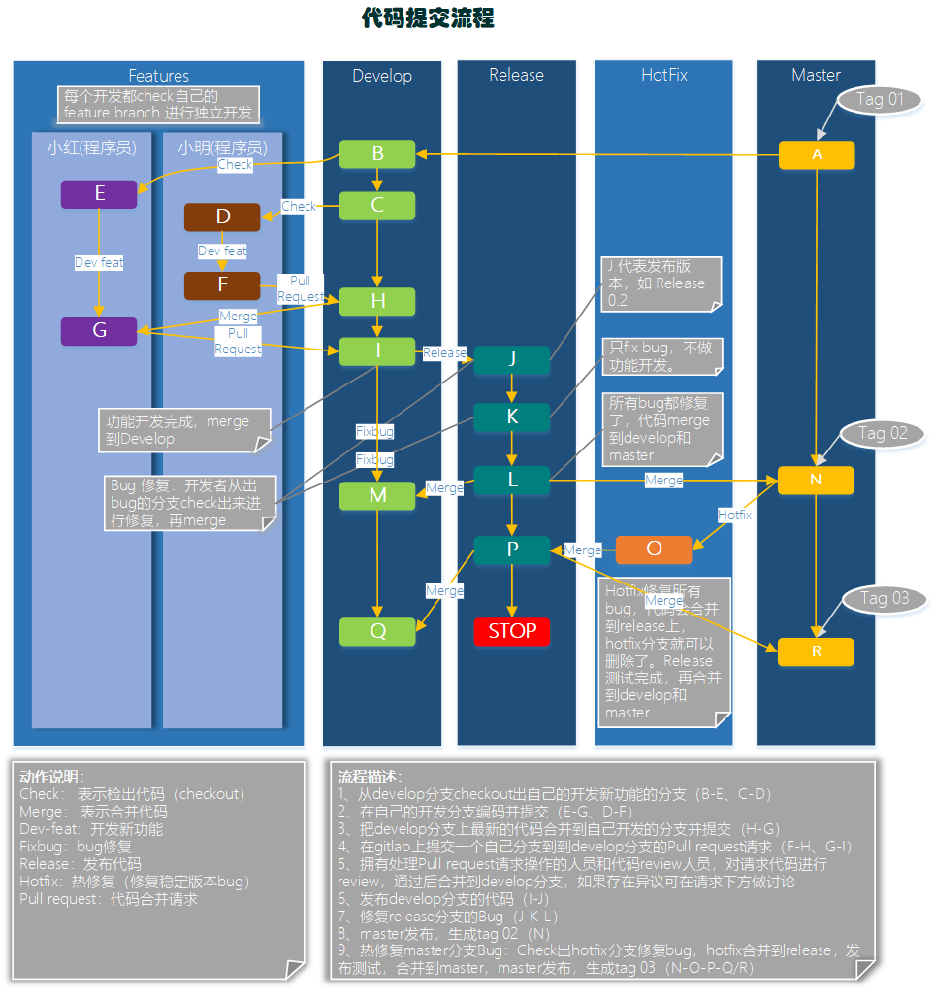
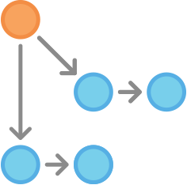
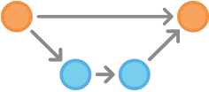
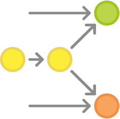
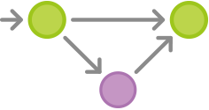

git 协同开发指南
============================


这份文档主要思想基于gitflow。

## 1 概述

这份指南会包含两大块内容：

- 1、分支结构规范，【附录一】

- 2、commit message 规范，【附录二】

  

## 2 Git Flow 的开发活动图

> 开发者为中心的活动图



```txt
上图简要描述了开发者如何进行开发代码，提交代码和发布代码，修复bug的过程。详图见Visio 文档
1、从develop分支checkout出自己的开发新功能的分支（B-E、C-D）
2、在自己的开发分支编码并提交（E-G、D-F）
3、把代码合并到develop分支（G/F-H）
4、发布develop分支的代码（H-I）
5、修复release分支的Bug（I-J-K）
6、master发布，生成tag 02（M）
7、热修复master分支Bug：Check出hotfix分支修复bug，hotfix合并到release，发布测试，合并到master，master发布，生成tag 03（M-N-O-P/Q） 

```


## 3 Quick Start

---------------------

>  有疑问，Quick Start，实践一下！

下面的示例演示本工作流如何用于管理单个发布循环。假设你已经创建了一个中央仓库。

- 详细的分支工作方式参考【附录一】
- 注意提交代码时遵循commit mesage 规范【附录二】
- 在IntelliJ IDEA 中操作 请参考【附录三】

### 3.1 创建开发分支（一般已创建可跳过）


第一步为`master`分支配套一个`develop`分支。简单来做可以[本地创建一个空的`develop`分支](https://www.atlassian.com/git/tutorial/git-branches#!branch)，`push`到服务器上：

```bash
git branch develop
git push -u origin develop
```

以后这个分支将会包含了项目的全部历史，而`master`分支将只包含了部分历史。其它开发者这时应该[克隆中央仓库](https://www.atlassian.com/git/tutorial/git-basics#!clone)，建好`develop`分支的跟踪分支：

```bash
git clone ssh://user@host/path/to/repo.git
git checkout -b develop origin/develop

#【译注】当没有本地分支 develop 时，
# 最后一条命令，我使用更简单的 git checkout develop
# 会自动 把 远程分支origin/develop 检出成 本地分支 develop
```

现在每个开发都有了这些历史分支的本地拷贝。

### 3.2 小红和小明开始开发新功能



这个示例中，小红和小明开始各自的功能开发。他们需要为各自的功能创建相应的分支。新分支不是基于`master`分支，而是应该[基于`develop`分支](https://www.atlassian.com/git/tutorial/git-branches#!checkout)：

```bash
git checkout -b some-feature develop
```

他们用老套路添加提交到各自功能分支上：编辑、暂存、提交：
```bash
git status
git add <some-file>
git commit
```

### 3.3 小红完成功能开发



添加了提交后，小红觉得她的功能OK了。如果团队使用`Pull Requests`，这时候可以发起一个用于合并到`develop`分支。
否则她可以直接合并到她本地的`develop`分支后`push`到中央仓库：

```bash
# 拉取远程的develop分支，并且当前分支（本地分支some-feature）合并上远程分支develop
git pull origin develop
git checkout develop
# 本地分支some-feature合并上some-feature
#【注意】已经这个分支已经有远程的develop修改了，所以本地develop无需再做远程拉取的操作
git merge some-feature
git push
# 删除本地分支
git branch -d some-feature

#【译注】上面的命令注释为译者添加，以方便理解
# 更多说明参见 Issue #18
```

第一条命令在合并功能前确保`develop`分支是最新的。注意，功能决不应该直接合并到`master`分支。
冲突解决方法参考下面【冲突解决部分】。

### 3.4 小红开始准备发布


这个时候小明正在实现他的功能，小红开始准备她的第一个项目正式发布。
像功能开发一样，她用一个新的分支来做发布准备。这一步也确定了发布的版本号：

```bash
git checkout -b release-0.1 develop
```

这个分支是清理发布、执行所有测试、更新文档和其它为下个发布做准备操作的地方，像是一个专门用于改善发布的功能分支。

只要小红创建这个分支并`push`到中央仓库，这个发布就是功能冻结的。任何不在`develop`分支中的新功能都推到下个发布循环中。

### 3.5 小红完成发布



一旦准备好了对外发布，小红合并修改到`master`分支和`develop`分支上，删除发布分支。合并回`develop`分支很重要，因为在发布分支中已经提交的更新需要在后面的新功能中也要是可用的。
另外，如果小红的团队要求`Code Review`，这是一个发起`Pull Request`的理想时机。

```bash
git checkout master
git merge release-0.1
git push
git checkout develop
git merge release-0.1
git push
git branch -d release-0.1
```

发布分支是作为功能开发（`develop`分支）和对外发布（`master`分支）间的缓冲。只要有合并到`master`分支，就应该打好`Tag`以方便跟踪。

```bash
git tag -a 0.1 -m "Initial public release" master
git push --tags
```

`Git`有提供各种勾子（`hook`），即仓库有事件发生时触发执行的脚本。
可以配置一个勾子，在你`push`中央仓库的`master`分支时，自动构建好对外发布。

### 3.6 最终用户发现Bug



对外发布后，小红回去和小明一起做下个发布的新功能开发，直到有最终用户开了一个`Ticket`抱怨当前版本的一个`Bug`。
为了处理`Bug`，小红（或小明）从`master`分支上拉出了一个维护分支，提交修改以解决问题，然后直接合并回`master`分支：

```bash
git checkout -b issue-#001 master
# Fix the bug
git checkout master
git merge issue-#001
git push
```

就像发布分支，维护分支中新加这些重要修改需要包含到`develop`分支中，所以小红要执行一个合并操作。然后就可以安全地[删除这个分支](https://www.atlassian.com/git/tutorial/git-branches#!branch)了：

```bash
git checkout develop
git merge issue-#001
git push
git branch -d issue-#001
```

---------------------
---------------------
---------------------


## 附录一: 分支的工作方式
---------------------

`Gitflow`工作流仍然用中央仓库作为所有开发者的交互中心。和其它的工作流一样，开发者在本地工作并`push`分支到要中央仓库中。

分支结构图：


- 绿色代表```历史分支 master```

- 橘色代表```历史分支 develop```

- 黄色代表```发布分支 release-X```

- 蓝色代表```功能分支 feature-X```

- 灰色代表```热修复分支 hotfix-X```

  

### 历史分支

相对使用仅有的一个`master`分支，`Gitflow`工作流使用2个分支来记录项目的历史。`master`分支存储了正式发布的历史，而`develop`分支作为功能的集成分支。
这样也方便`master`分支上的所有提交分配一个版本号。


剩下要说明的问题围绕着这2个分支的区别展开。

### 功能分支

每个新功能位于一个自己的分支，这样可以[`push`到中央仓库以备份和协作](https://www.atlassian.com/git/tutorial/remote-repositories#!push)。
但功能分支不是从`master`分支上拉出新分支，而是使用`develop`分支作为父分支。当新功能完成时，[合并回`develop`分支](https://www.atlassian.com/git/tutorial/git-branches#!merge)。
新功能提交应该从不直接与`master`分支交互。


注意，从各种含义和目的上来看，功能分支加上`develop`分支就是功能分支工作流的用法。但`Gitflow`工作流没有在这里止步。

### 发布分支


一旦`develop`分支上有了做一次发布（或者说快到了既定的发布日）的足够功能，就从`develop`分支上`fork`一个发布分支。
新建的分支用于开始发布循环，所以从这个时间点开始之后新的功能不能再加到这个分支上——
这个分支只应该做`Bug`修复、文档生成和其它面向发布任务。
一旦对外发布的工作都完成了，发布分支合并到`master`分支并分配一个版本号打好`Tag`。
另外，这些从新建发布分支以来的做的修改要合并回`develop`分支。

使用一个用于发布准备的专门分支，使得一个团队可以在完善当前的发布版本的同时，另一个团队可以继续开发下个版本的功能。
这也打造定义良好的开发阶段（比如，可以很轻松地说，『这周我们要做准备发布版本4.0』，并且在仓库的目录结构中可以实际看到）。

常用的分支约定：

```
用于新建发布分支的分支: develop
用于合并的分支: master
分支命名: release-* 或 release/*
```

### 维护分支


维护分支或说是热修复（`hotfix`）分支用于生成快速给产品发布版本（`production releases`）打补丁，这是唯一可以直接从`master`分支`fork`出来的分支。
修复完成，修改应该马上合并回`master`分支和`develop`分支（当前的发布分支），`master`分支应该用新的版本号打好`Tag`。

为`Bug`修复使用专门分支，让团队可以处理掉问题而不用打断其它工作或是等待下一个发布循环。
你可以把维护分支想成是一个直接在`master`分支上处理的临时发布。


##  附录二: commit message 规范

---------------------

每次提交，Commit message 都包括三个部分：Header，Body 和 Footer。

> ```
> <type>(<scope>): <subject>
> // 空一行
> <body>
> // 空一行
> <footer>
>
> ```

其中，Header 是必需的，Body 和 Footer 可以省略。

不管是哪一个部分，任何一行都不得超过72个字符。这是为了避免自动换行影响美观。

###  Header

Header部分只有一行，包括三个字段：`type`（必需）、`scope`（可选）和`subject`（必需）。

#### type

`type`用于说明 commit 的类别，只允许使用下面7个标识。

> - feat：新功能（feature）
> - fix：修补bug
> - docs：文档（documentation）
> - style： 格式（不影响代码运行的变动）
> - refactor：重构（即不是新增功能，也不是修改bug的代码变动）
> - test：增加测试
> - chore：构建过程或辅助工具的变动

如果`type`为`feat`和`fix`，则该 commit 将肯定出现在 Change log 之中。其他情况（`docs`、`chore`、`style`、`refactor`、`test`）由你决定，要不要放入 Change log，建议是不要。

#### scope

`scope`用于说明 commit 影响的范围，比如数据层、控制层、视图层等等，视项目不同而不同。

#### subject

`subject`是 commit 目的的简短描述，不超过50个字符。

> - 以动词开头，使用第一人称现在时，比如`change`，而不是`changed`或`changes`
> - 第一个字母小写
> - 结尾不加句号（`.`）

### Body

Body 部分是对本次 commit 的详细描述，可以分成多行。下面是一个范例。

> ```
> More detailed explanatory text, if necessary.  Wrap it to 
> about 72 characters or so. 
>
> Further paragraphs come after blank lines.
>
> - Bullet points are okay, too
> - Use a hanging indent
>
> ```

有两个注意点。

（1）使用第一人称现在时，比如使用`change`而不是`changed`或`changes`。

（2）应该说明代码变动的动机，以及与以前行为的对比。

### Footer

Footer 部分只用于两种情况。

#### 不兼容变动

如果当前代码与上一个版本不兼容，则 Footer 部分以`BREAKING CHANGE`开头，后面是对变动的描述、以及变动理由和迁移方法。

> ```
> BREAKING CHANGE: isolate scope bindings definition has changed.
>
>     To migrate the code follow the example below:
>
>     Before:
>
>     scope: {
>       myAttr: 'attribute',
>     }
>
>     After:
>
>     scope: {
>       myAttr: '@',
>     }
>
>     The removed `inject` wasn't generaly useful for directives so there should be no code using it.
>
> ```

#### 关闭 Issue

如果当前 commit 针对某个issue，那么可以在 Footer 部分关闭这个 issue 。

> ```
> Closes #234
>
> ```

也可以一次关闭多个 issue 。

> ```
> Closes #123, #245, #992
>
> ```

### Revert

还有一种特殊情况，如果当前 commit 用于撤销以前的 commit，则必须以`revert:`开头，后面跟着被撤销 Commit 的 Header。

> ```
> revert: feat(pencil): add 'graphiteWidth' option
>
> This reverts commit 667ecc1654a317a13331b17617d973392f415f02.
>
> ```

Body部分的格式是固定的，必须写成`This reverts commit <hash>.`，其中的`hash`是被撤销 commit 的 SHA 标识符。

如果当前 commit 与被撤销的 commit，在同一个发布（release）里面，那么它们都不会出现在 Change log 里面。如果两者在不同的发布，那么当前 commit，会出现在 Change log 的`Reverts`小标题下面。


**本页编辑**      **[@gongshiwen](http://192.168.1.23/gongshiwen)** 

